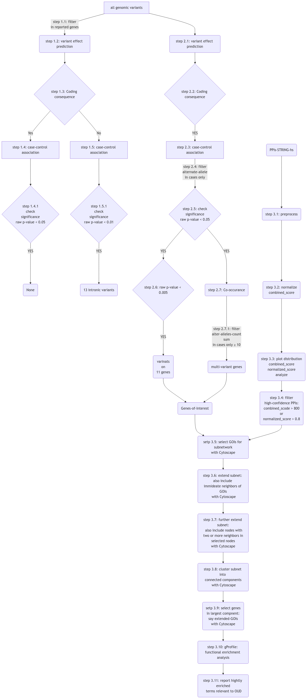

# GWAS
This repository is dedicated to host the in-house scripts developed and used for GWAS.


# Abbreviation
| ABVR     | Detail                                  |
| -------- | --------------------------------------- |
| js       | Joint calling                           |
| gs       | Genes selected only                     |
| vep      | Variant effect predictor output         |
| qc       | Quality control                         |
| mscvo    | Most severe consequence variant only    |

# Let's install singularity to enable use of tools available as sigularity-image 
## We used Ubuntu 24.04 (LTS)
First of all I added the singularity repository using
```
wget -O- http://neuro.debian.net/lists/noble.us-tn.libre | sudo tee /etc/apt/sources.list.d/neurodebian.sources.list
sudo apt-key adv --recv-keys --keyserver hkps://keyserver.ubuntu.com 0xA5D32F012649A5A9
```
follow the instructions
```
sudo apt update
```
after completion use
```
sudo apt install singularity
```
It installed singularity version 4.1.1, you can check your's using
singularity version


# Required Tools
* PLINK
* VEP (using an .sif)
I followed the instructions provided at link below
https://useast.ensembl.org/info/docs/tools/vep/script/vep_download.html#singularity
to get the vep.sif, install and then setup the cache for homo_sapiens reference genome assembly GRCh38
We used $PROJECTDIR/tools for vep_data instead of $HOME provided in the instrctions. Where PROJECTDIR is the 
main-folder of this project.

* samtools (bcftools) v1.20

# Large-files can not be uploaded to GitHub rather made available from groups website
Dowload large file from http://compbio.clemson.edu/media/download/large-files.zip
Unzip and copy the folders inside unzipped folder to the folders with same name in OUDgwas folder

# Workflow


